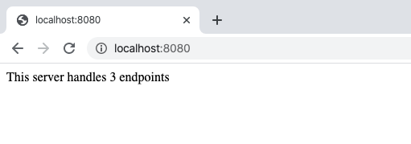
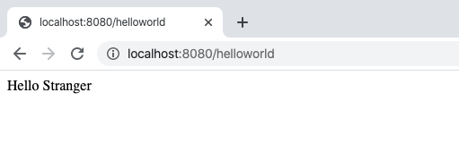
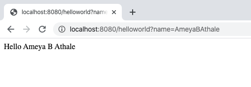
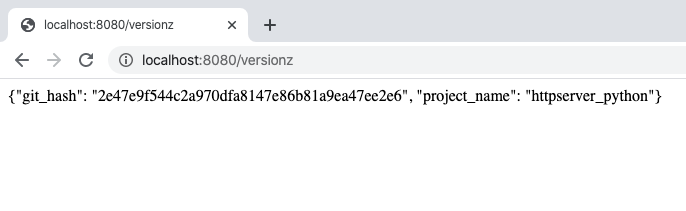

# http-server using Python - output

##### Type 'make run-dev' in the terminal

1. Initial page
go to the browser and type 'http://localhost:8080/'
the result would be

2. Endpoint /helloworld returning "Hello Stranger"
go to the browser and type 'http://localhost:8080/helloworld'
the result would be

3. Endpoint /helloworld?name=[AmeyaBAthale] returning "Hello Ameya B Athale"
go to the browser and type 'http://localhost:8080/helloworld?name=AmeyaBAthale'
the result would be

4. Endpoint http://localhost:8080/versionz returning "{"git_hash": "be23deca05f50e0e4e6aa695cace119bfdbff846", "project_name": "httpserver_python"}"
go to the browser and type 'http://localhost:8080/versionz'
the result would be

